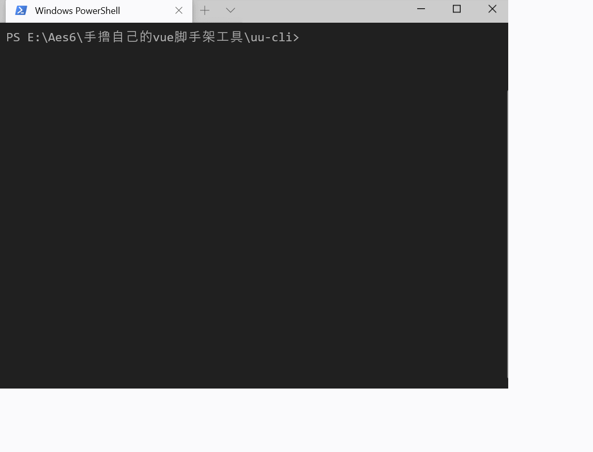

# uu-cli
一个简单的前端脚手架（跟学 、未发布到npm）

### 1. `uu-cli --help `  获取命令提示

| Options                 | describe     |
| ----------------------- | ------------ |
| `uu-cli -V | --version` | 获取版本号   |
| `uu-cli -h | --help`    | 获取命令提示 |

| Commands                           |                   |
| ---------------------------------- | ----------------- |
| `uu-cli create | c <project name>` | 拉取模板创建项目  |
| `*`                                | command not found |

### 2. 使用到的npm包

| commander             | 参数解析  --help就借助了它                                   |
| --------------------- | :----------------------------------------------------------- |
| **inquirer**          | **交互式命令行工具，有它就可以实现命令行的选择功能**         |
| **download-git-repo** | **在git中下载模板**                                          |
| **chalk**             | **粉笔帮我们在控制台中画出各种各样的颜色**                   |
| **metalsmith**        | **读取所有文件，实现模板渲染**                               |
| **consolidate**       | **统一模板引擎**  （使用 **ejs** 模板）                      |
| **ora**               | **显示 加载中...  效果**                                     |
| **util**              | **util中的promisify可以把异步的API转换成promise方法**（和**download-git-repo**配合使用） |
| **axios**             | **从github的API中获取模板信息**                              |

### 3. 示例

- 使用模板创建的项目放在目录的my-project中

